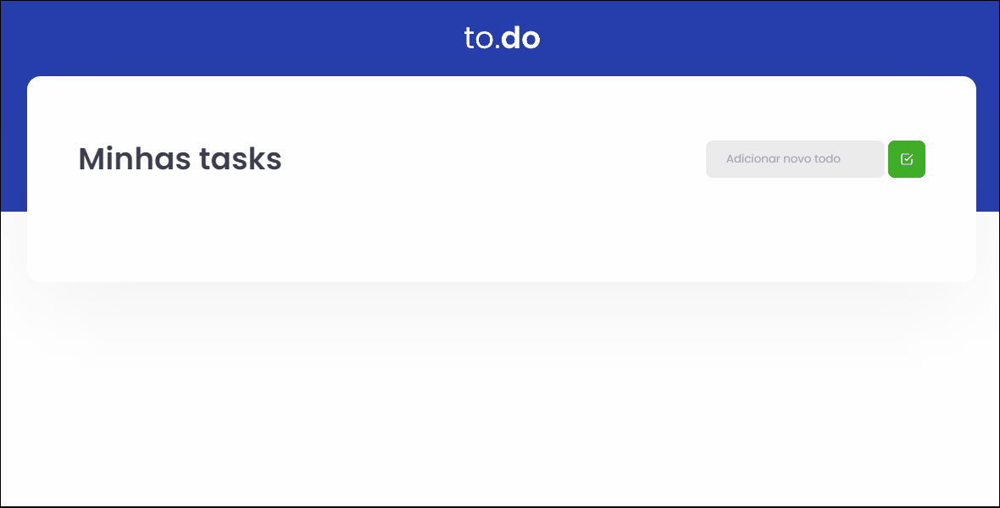

# Listando, editando e deletando notas com useState

## 💻 Sobre o projeto

Esse é o primeiro desafio do Ignite na trilha de ReactJS, um "To Do" para listagem, edição e remoção de notas usando apenas o useState do React.

<h1 align="center">
    
</h1>
